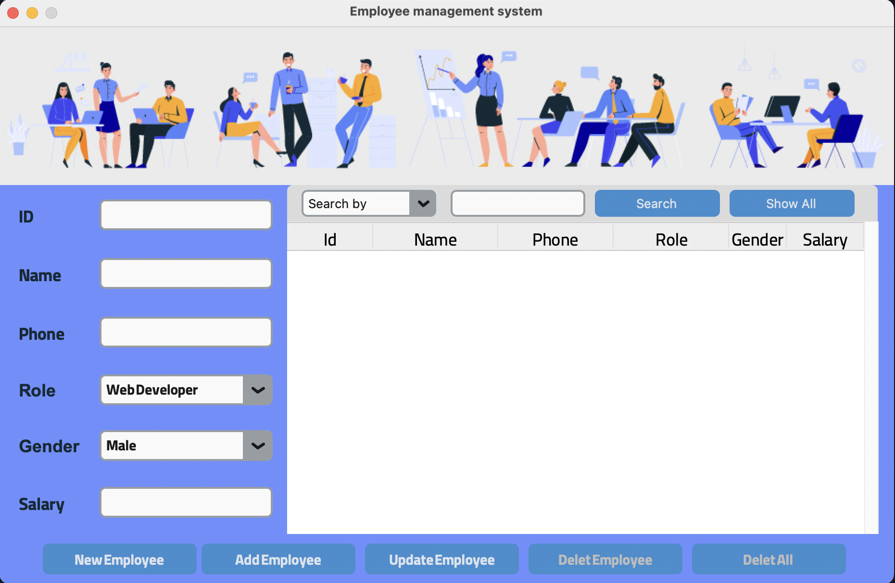
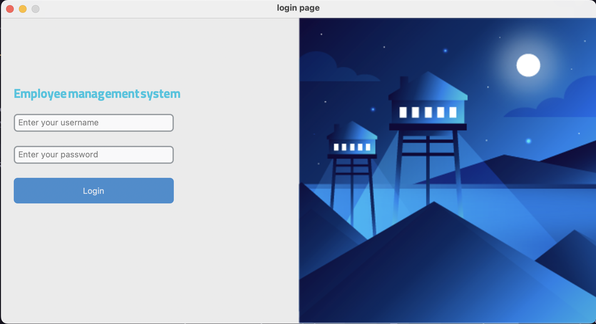

# Employee management system

This project was developed as a university database course assignment.
The main goal is to demonstrate how to connect a Python application to a SQL database and interact with it through a simple graphical user interface (GUI) built with Tkinter.

## Features

- Database connection and management (SQL)
- Insert, update, delete, and view records
- User-friendly interface with Tkinter
- Example use cases for practicing database operations

## 🛠 Skills

  
  

## Demo

  
  

## 🔗 Links

  

